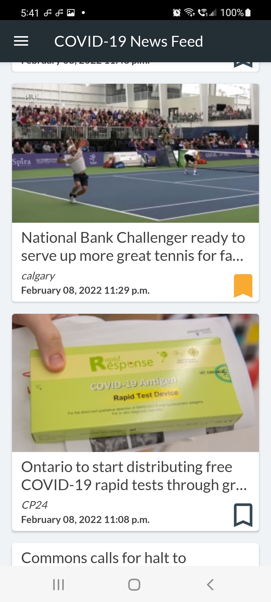
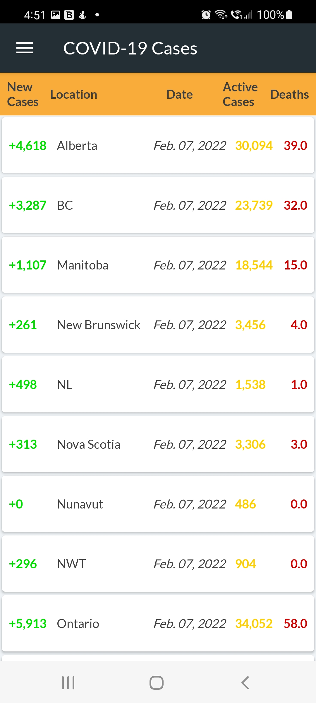
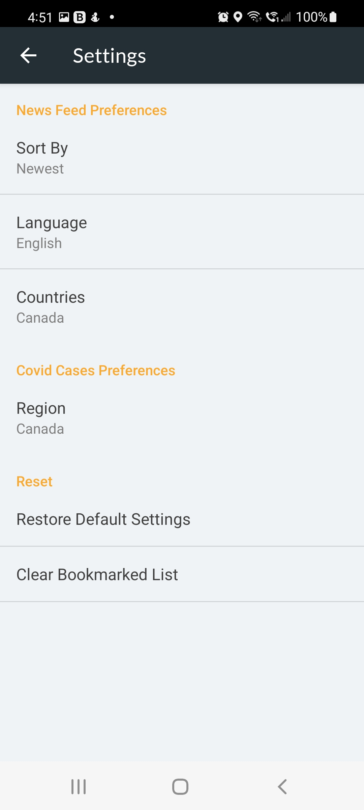

# Covid News Tracking App
An Android application that gathers Covid-19 data from multiple APIs and displays the information in separate RecyclerViews. This project was built without the use of external libraries and utilizes SharedPreferences to save the users bookmarked articles.

You can choose to view:
- Top Covid-19 News Stories
- Latest Covid-19 Case Numbers

# Covid-19 News Fragment
This fragment uses the mediastack.com API to populate a RecyclerView and allows the user to bookmark a given article which is then saved in SharedPreferences.

# Covid-19 Cases Fragment
This fragment uses the opencovid.ca API to populate a RecyclerView with the latest new Covid-19 cases, which is sorted by province. 

# Bookmarked Fragment
This fragment loads a list of bookmarked articles which is stored within SharedPreferences. Users can remove individual articles by clicking on the trash icon.

# Preferences Fragment
This fragment allows the user to select location and language settings for the articles populated within the Covid-19 News Fragment and can also choose to limit the data shown in the Covid-19 Cases Fragment to a specific province. From this screen you are also able to restore the default preference settings and clear all the saved articles from the Bookmarked Fragment.

# API
- Media Stack
- Open Covid

# Developed By
Grayson Ruffo

      Copyright 2022 Grayson Ruffo
