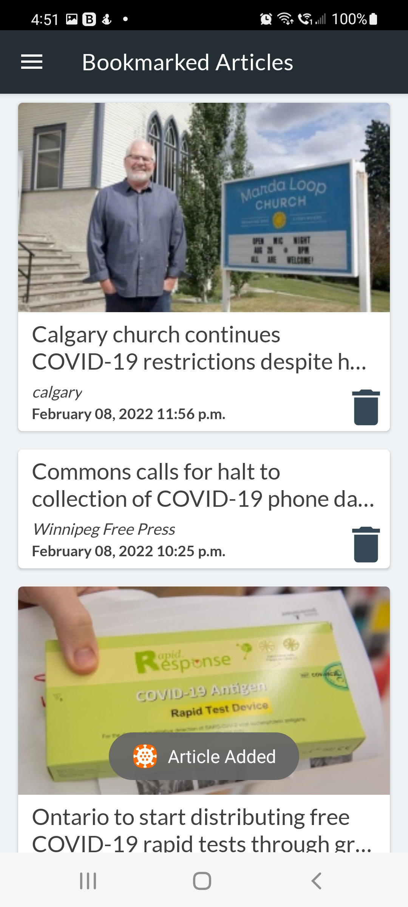

# Covid News Tracking App
Built with Java, this Android application allows users to get up-to-date COVID data from their region by parsing the JSON response from multiple news APIs. This project was built without the use of external libraries and utilizes SharedPreferences to save the users bookmarked articles.

You can choose to view:
- Top Covid-19 News Stories
- Latest Covid-19 Case Numbers

# Covid-19 News Fragment
This fragment uses the mediastack.com API to populate a RecyclerView and allows the user to bookmark a given article which is then saved in SharedPreferences.

# Covid-19 Cases Fragment
This fragment uses the opencovid.ca API to populate a RecyclerView with the latest Covid-19 case numbers and sorts it by province. 

# Bookmarked Fragment
Users have the option to bookmark articles which is then stored within SharedPreferences, allowing for offline access.

# Preferences Fragment
Here users can select location and language settings for the articles populated within the Covid-19 News Fragment and can also choose to limit the data shown in the Covid-19 Cases Fragment to a specific province. From this screen you are also able to restore the default preference settings and clear all the saved articles from the Bookmarked Fragment.

## Frameworks
- Android Preferences

## API
- Media Stack
- Open Covid

## Permissions
- Vibrate
- Access Network State
- Internet

## Required OS
Android 5.0 and up.

# Developed By
Grayson Ruffo

      Copyright 2022 Grayson Ruffo
